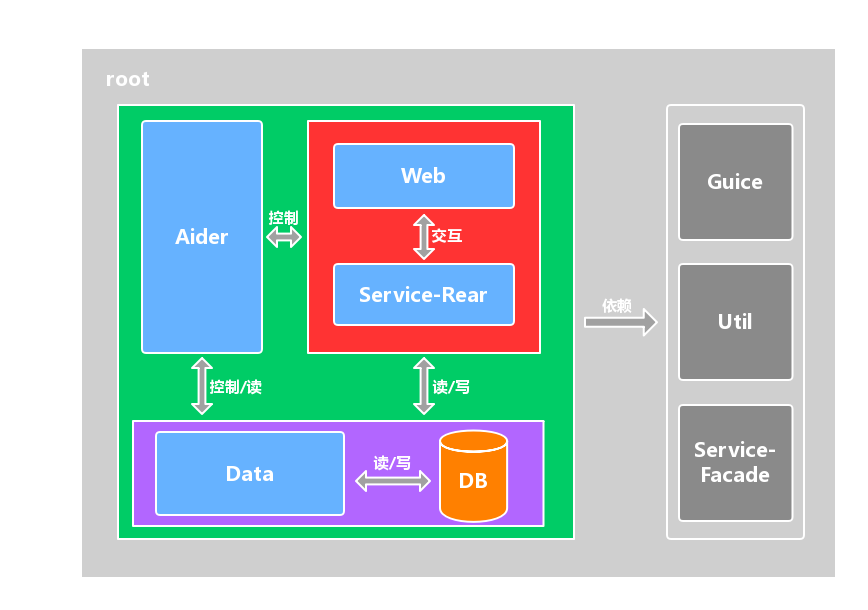

# 架构方案草稿

## 技术方案
核心体系为Vertx Java、Guice和Lombok。详情如下列表所示：

1. guice：ioc容器，依赖注入
2. lombok：简化代码
3. slf4j-log4j12：日志记录  
	a. log4j 日志记录实现
4. commons-lang3：第三方工具包
5. Vertx Java  
	a. vertx-web：创建http服务器，http请求路由  
	b. vertx-hazelcase：集群管理器  
	&nbsp;&nbsp;&nbsp;&nbsp;1) hazelcast 集群管理器实现  
	c. vertx-auth-jwt：http认证授权服务  
	d. vertx-rx-java: rx化api实现  
	e. vertx-codegen：服务代理代码生成器，与vertx-service-proxy一起使用  
	f. vertx-service-proxy：服务代理实现
> note：集体版本可查看项目.pom文件properties节点

## 体系结构
共划分为七个模块。分别为四个服务包，aider、web、data和service-rear。三个基础包，guice、util和service-facade。各包的详细作用可参加下表。

	-root
		-guice 集成了guice ioc容器的集群服务启动器
			-binder ioc容器绑定类，默认提供Vertx, ConfigHolder实现
			-cluster 集群启动器
			-properties 配置文件加载组件
			-scanner 扫描器，内置服务提供者(ServiceProvider)扫描器和路由(Route)扫描器
			-verticle verticle工具包，内置verticle默认扫描器
			-GuiceLauncher.java 启动入口
	
		-web 提供web服务，系统controller层载体
			-binder ioc容器绑定类，默认提供Router实现
			-constant web服务的相关常量
			-launcher web服务启动器
			-route route包，controller层主要业务包，注意模块划分
			-verticles verticle包
			-ApplicationMain.java 服务入口
	
		-service-facade rpc服务接口
			-generated 服务代理代码生成输出目录
			-java
				-scanner 扫描器，内置服务代理扫描器，外部使用需要注意扫描范围
	
		-service-rear rpc服务实现载体
			-ApplicationMain.java 服务入口
	
		-util 全局工具包，严格划分系统工具作用域
			-constant 通用常量
			-result 通用结果包
			-scanner 通用扫描器
	
		-aider 系统辅助服务载体
			-ApplicationMain.java 服务入口
	
		-data 系统数据访问层基础服务载体，注意该模块不提供业务服务
			-binder ioc容器绑定类，默认提供数据库客户端实现
			-client 客户端加载器
			-constant 数据访问相关常量
			-launcher 数据访问服务启动器
			-service 数据访问实现载体
			-verticles verticle包
			-ApplicationMain.java 服务入口
### 基础结构图

## 架构思想
### 微服务
系统采用微服务形式搭建，系统由多个微服务构成，微服务可部署至一台或多台服务器上且可部署一或多个实例。微服务之间可互相感知存在和通信。微服务之间每`15s`发送一次存在感知请求。若某个服务断开可以通过日志中的连接错误知晓。
### 微服务种类
服务种类可划分为aider、web、data和service-rear。
#### 1. aider服务
aider服务在系统中主要起到辅助作用，不具备系统业务功能，面向开发或维护人员，主要提供对其他服务的重启、日志查询、测试和应用检查等功能。aider服务拥有自己的http环境和接口，与系统业务完全隔离。仅需要部署一个服务实例。且需要做严格的权限策略，需要部署在内网以提高安全性。
#### 2. web服务
系统业务web服务载体。Controller层载体，面向前端。Controller层中的所有http接口都应该建立标准文档。默认提供认证、授权和用户操作日志记录等基础功能。其他服务接口需要置放在该服务的route包中，且需要严格划分业务模块。
#### 3. data服务
系统数据访问服务载体，可以理解为dao层。提供基础的无业务的数据访问服务。如分页数据访问，可在该层实现物理分页。数据库客户端由该层维护。
#### 4. service-rear服务
系统业务服务载体，可理解为service层。提供具体的系统业务服务。服务需要严格划分业务模块。与web服务接口可呈现一对多，或一对一的关系。
### 基础包
基础包可划分为guice、util和service-facade。
#### 1. guice包
其他服务都需要依赖该基础包，可理解为其他服务的内核，服务中的配置参数加载、集群启动、verticle扫描都由该基础包完成。该包下还提供了服务提供者扫描器，可在任何一个服务中启用。
#### 2. util包
提供通用的工具包，如常量、包扫描器和结果集等。
#### 3. service-facade包
rpc服务接口，可在该包中定义服务接口，通常暴露的是服务代理接口。由`service-proxy`组件生成。该包中内置了服务接口扫描器，可通过该扫描器返回一个`Binder`(guice中的module)，然后注入到ioc容器中。需要注意提供给扫描器不同的扫描范围(包路径)。服务接口需要严格按照模块放置在不同的包结构中。不同的服务内可以仅扫描需要的包路径，以此来划分范围和模块。
## Verticle实例
服务可由一个或多个Verticle组成，Verticle拥有一些有用的特性，如增加多个实例、高可用等。系统中的所有Verticle均可自定义这些配置。Verticle可以理解为一个粒度较小的服务。guice包的中Verticle扫描器会将一个基础的ioc容器即Injector注入到每一个Verticle中，即每一个Verticle中都可以往该基础ioc容器中注入一组bean实例，以此来定制自己的ioc容器。
## 最佳实践